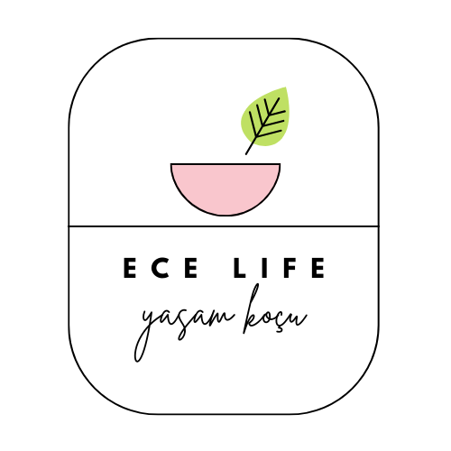

# BLM2537: AĞ TABANLI PROGRAMLAMAYA GİRİŞ - FİNAL PROJESİ

## Proje: Ece's Life - Yaşam Koçluğu Web Sitesi

**İsim Soyisim:** Ece İrem Şişer  
**Öğrenci No:** 22290727  
**GitHub Kullanıcı Adı:** eceirem  
**Proje Linki:** [Ece's Life](https://github.com/eceirem/BLM2537-Final-Project)

---

## Proje Amacı
Bu proje, sağlıklı ve düzenli bir yaşam tarzı konusunda kullanıcıları bilgilendirmek ve motive etmek amacıyla tasarlanmış bir yaşam koçluğu web sitesidir.

---

## Proje İçeriği
Ece’s Life isimli yaşam koçluğu firması için toplamda 16 adet sayfa içeren bir web sitesi tasarlanmıştır. Sitede bulunan ana sayfalar ve içerikleri aşağıda detaylı olarak açıklanmıştır.

---

### Ana Sayfalar ve İçerikleri

#### 1. Anasayfa
- **Banner:** Altı adet farklı banner fotoğrafı, üç saniyede bir değişmektedir.
- **Sağlık Nedir?**
- **Önce Ölçün Sonra Düşünün:** İki farklı sayfaya yönlendirir ve gerekli hesaplamalar JavaScript ile yapılır.
- **Hakkımızda**
- **Motivasyon**
- **Ne Var Ne Yok?:** Üç adet köşe yazısı bulunur.

#### 2. Sağlık Sayfası
- **Sağlık Nedir?**
- **Önce Ölçün Sonra Düşünün**
- **Ne Yemeli?**
- **Tarifler:** Her içerikte diğer iki okuma içeriği sağ tarafta yer alır.

#### 3. Spor Sayfası
- **Sporun Önemi**
- **Neden Spor Yapmalıyız?**
- **Haftada Kaç Kere Spor Yapmalıyız?**
- **Önce Ölçün Sonra Düşünün**
- **Sporcular için Doğru Beslenme**
- **Egzersiz Önerisi:** Yaş, BMI ve ameliyat durumu göz önünde bulundurularak öneriler sunulur ve yeni bir sekmede YouTube üzerinden açılır.

#### 4. İletişim Sayfası
- **Google Maps Entegrasyonu:** Sayfanın sol tarafında harita görüntüsü bulunur.
- **İletişim Formu:** Sağ tarafta danışanların randevu alma nedenlerini belirtebilecekleri bir form yer alır.

---

Her sayfada logo, navigasyon barı ve footer bulunmaktadır. Logo üzerine tıklandığında anasayfaya yönlendirilir. Bu projede JavaScript kullanılarak çeşitli etkileşimli özellikler eklenmiştir.

---

## Kurulum ve Kullanım

1. **Proje Dosyalarını İndirin:**
    ```sh
    git clone https://github.com/eceirem/BLM2537-Final-Project.git
    ```

2. **Proje Dizini İçine Girin:**
    ```sh
    cd BLM2537-Final-Project
    ```

3. **Web Tarayıcınızda index.html Dosyasını Açın:**
    ```sh
    open index.html
    ```

---

## Ekran Görüntüleri

### Anasayfa


### Sağlık Sayfası


### Spor Sayfası


### İletişim Sayfası


---

